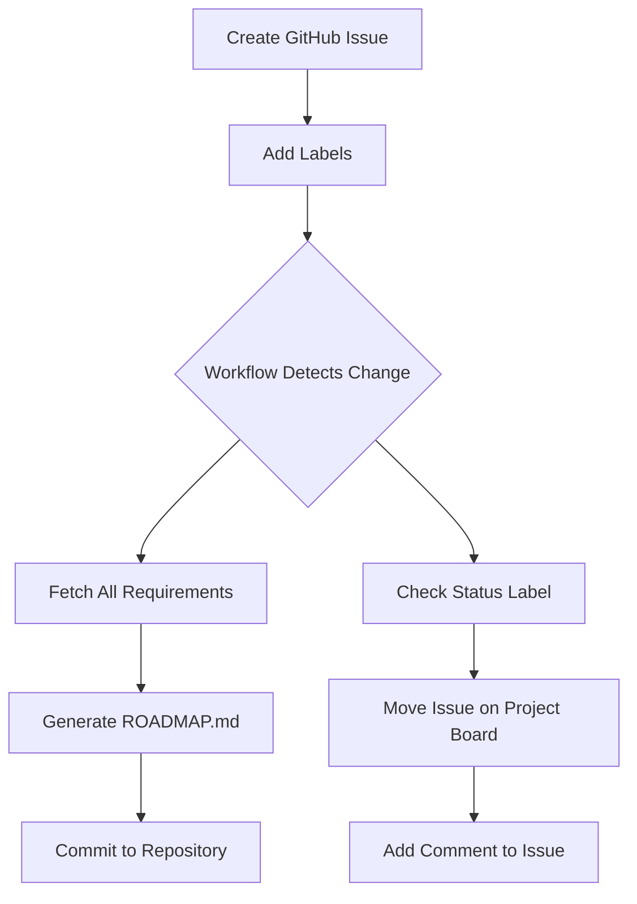

# 🗺️ Understanding the ROADMAP.md System

## 📖 What is ROADMAP.md?

**ROADMAP.md** is an **automatically generated tracking document** that provides a high-level view of your project's progress across all development phases. Think of it as your project's "mission control dashboard."

---

## 🎯 Purpose & Benefits

### **What It Does:**
- ✅ **Visual Progress Tracking** - See what's complete, in-progress, and planned at a glance
- ✅ **Phase Organization** - Groups requirements by MVP, Phase 2, Phase 3, Phase 4
- ✅ **Status Monitoring** - Tracks completion status of all requirements
- ✅ **Auto-Updates** - Stays synchronized with GitHub Issues automatically
- ✅ **Team Alignment** - Everyone sees the same up-to-date roadmap

### **What It's NOT:**
- ❌ **Not a PRD** - Doesn't contain detailed specifications (that's PRODUCT_REQUIREMENTS_DOCUMENT.md)
- ❌ **Not Technical Docs** - Doesn't have implementation details (that's in requirement files)
- ❌ **Not Static** - It's dynamic and auto-generated, not manually maintained

---

## 🏗️ Document Architecture

Your project has **3 layers of documentation**:

### **Layer 1: Strategic Vision**
```
PRODUCT_REQUIREMENTS_DOCUMENT.md
├── Product goals and objectives
├── Target audience and market analysis
├── Feature overview and priorities
└── Success metrics
```
**Purpose:** Defines WHAT we're building and WHY
**Updated:** Manually when strategy changes

### **Layer 2: Detailed Specifications**
```
github-setup/requirements/
├── AUTH-001-user-authentication.md
├── PROFILE-001-user-profile-system.md
├── WEEKLY-001-weekly-artist-lists.md
└── ... (12 requirement files)
```
**Purpose:** Defines HOW each feature works in detail
**Updated:** Manually as features are designed

### **Layer 3: Progress Tracking**
```
ROADMAP.md (Auto-generated)
├── Progress statistics
├── Requirements by phase
├── Status for each requirement
└── Links to GitHub Issues
```
**Purpose:** Shows WHERE we are in the development process
**Updated:** Automatically by GitHub Actions

---

## 🔄 How the Automation Works

### **Step-by-Step Process:**



### **Triggering Events:**

1. **Issue Creation** - New requirement issue created
2. **Issue Updates** - Existing issue edited
3. **Label Changes** - Status label added/removed
4. **Issue Closed** - Requirement marked complete
5. **Weekly Schedule** - Runs every Sunday at midnight UTC
6. **Manual Trigger** - You can run it anytime from Actions tab

### **Label System:**

| Label Type | Examples | Purpose |
|------------|----------|---------|
| **Identifier** | `requirement` | Marks issue as a requirement (required) |
| **Phase** | `phase-1`, `phase-2`, `phase-3`, `phase-4` | Categorizes by development phase |
| **Priority** | `priority-p0`, `priority-p1`, `priority-p2`, `priority-p3` | Indicates importance level |
| **Status** | `status-backlog`, `status-todo`, `status-in-progress`, `status-done` | Tracks current state |
| **Component** | `component-auth`, `component-profile`, etc. | Groups by feature area |

---

## 🎨 How ROADMAP.md Looks

### **Structure:**

```markdown
# Progress Overview Table
Shows counts for each phase (Complete/In Progress/Planned)

## Phase 1: MVP
### Complete (X)
- [x] Completed requirements with links

### In Progress (X)
- [ ] Requirements being worked on

### Planned (X)
- [ ] Requirements not started yet

## Phase 2: Enhanced Engagement
... (same structure)

## Legend & Instructions
Explains labels and how to use the system
```

### **Why It Looks Good:**

✅ **Clean Markdown Formatting** - Uses tables, emojis, and headers effectively
✅ **Visual Status Indicators** - Checkboxes show completion state
✅ **Direct Links** - Click to jump to GitHub Issues
✅ **Progress Statistics** - See counts at a glance
✅ **Helpful Documentation** - Includes legend and instructions

---

## 🚀 How to Use It

### **For Project Managers:**
1. View ROADMAP.md to see overall project status
2. Check progress percentages for each phase
3. Identify blockers (items stuck in one status)
4. Plan sprints based on "Planned" items

### **For Developers:**
1. Check "In Progress" section for current work
2. Move items by updating status labels
3. Close issues when features are complete
4. Review "Planned" section for upcoming work

### **For Stakeholders:**
1. Quick visual overview of project health
2. See what's shipped vs. what's coming
3. Understand development priorities
4. Track progress toward milestones

---

## 🔧 Project Board Integration

### **Automatic Column Sync:**

When you add a status label to an issue, the workflow automatically:

1. **Detects the label change** - Triggers within seconds
2. **Finds the issue** - Locates it in your GitHub Project board
3. **Moves to correct column** - Based on status label
4. **Confirms with comment** - Leaves a notification on the issue

### **Label → Column Mapping:**

| Status Label | Project Column |
|--------------|----------------|
| `status-backlog` | **Backlog** |
| `status-todo` | **To Do** |
| `status-in-progress` | **In Progress** |
| `status-done` | **Done** |

### **Why This is Powerful:**

- ✅ **Single source of truth** - Labels drive both roadmap and board
- ✅ **No manual updates** - Change label once, everything updates
- ✅ **Audit trail** - Comments show when/why items moved
- ✅ **Team coordination** - Everyone sees real-time status

---

## 📊 Example Workflow

### **Scenario: Starting Work on Authentication**

```bash
# 1. Issue exists in "To Do" with status-todo label
Issue #1: AUTH-001 - User Authentication

# 2. Developer starts work, changes label
Remove: status-todo
Add: status-in-progress

# 3. Workflow automatically:
- Updates ROADMAP.md (moves to "In Progress" section)
- Moves issue to "In Progress" column on project board
- Adds comment: "🔄 Automatically moved to In Progress column"

# 4. Work completes, developer changes label
Remove: status-in-progress
Add: status-done
Close issue

# 5. Workflow automatically:
- Updates ROADMAP.md (moves to "Complete" section)
- Moves issue to "Done" column on project board
- Increments completion statistics
```

---

## 🎯 Best Practices

### **Do's:**
✅ Use status labels consistently for all requirements
✅ Update labels as soon as status changes
✅ Keep requirement issues open until fully deployed
✅ Review ROADMAP.md weekly in team meetings
✅ Link ROADMAP.md in project README

### **Don'ts:**
❌ Don't manually edit ROADMAP.md (it will be overwritten)
❌ Don't skip status labels (workflow needs them)
❌ Don't close issues prematurely
❌ Don't remove the `requirement` label from tracked issues

---

## 🔗 Related Documents

- **[ROADMAP.md](../ROADMAP.md)** - The actual roadmap file (auto-generated)
- **[PRODUCT_REQUIREMENTS_DOCUMENT.md](../PRODUCT_REQUIREMENTS_DOCUMENT.md)** - Product vision and strategy
- **[BUSINESS_PLAN.md](../BUSINESS_PLAN.md)** - Business model and revenue strategy
- **[Requirement Files](requirements/)** - Detailed feature specifications
- **[Setup Instructions](SETUP_INSTRUCTIONS.md)** - How to configure GitHub workflow

---

## ❓ FAQ

### **Q: Can I edit ROADMAP.md manually?**
A: No, it's auto-generated and will be overwritten. Update GitHub Issues instead.

### **Q: How often does it update?**
A: Immediately when issues change, plus weekly on Sundays at midnight UTC.

### **Q: What if I don't use GitHub Projects?**
A: ROADMAP.md still works! The project board sync is optional.

### **Q: Can I customize the format?**
A: Yes! Edit the workflow file `github-setup/workflows/roadmap-generator.yml`.

### **Q: Does this work with private repos?**
A: Yes, GitHub Actions work the same in private repositories.

---

## 🆘 Troubleshooting

### **ROADMAP.md not updating:**
1. Check that issues have `requirement` label
2. Verify workflow is enabled in Actions tab
3. Check workflow run logs for errors
4. Ensure GitHub token has write permissions

### **Project board not syncing:**
1. Verify project board exists and is linked to repo
2. Check that "Status" field exists in project
3. Ensure column names match exactly (Backlog, To Do, In Progress, Done)
4. Check workflow logs for GraphQL errors

### **Missing requirements in roadmap:**
1. Ensure issues have `requirement` label
2. Check for proper phase labels (`phase-1`, etc.)
3. Verify issue state (open vs. closed)
4. Manually trigger workflow to force refresh

---

_Last Updated: 2025-10-20_
_This document explains the ROADMAP.md automated tracking system._
